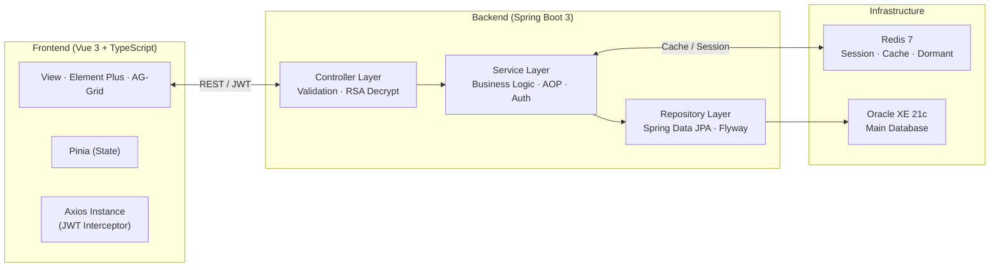

# 💻 BonScore (Bons-Pops) Framework Project
> **Spring Boot 3 & Vue 3 기반의 보안 중심 웹 애플리케이션 프레임워크**

### **Back-end**
<p>
  
  
  
  
</p>

### **Persistence & Database**
<p>
  
  
  
  
</p>

### **Front-end**
<p>
  
  
  
  
  
</p>

### **Tools & Dev Environment**
<p>
  
  
  
  
</p>

---

## 🎯 Project Overview

본 프로젝트는 단순한 기능 구현을 넘어 "**지속 가능한 코드**"와 "**보안**"을 최우선으로 설계된 풀스택 웹 애플리케이션 프레임워크입니다.

과거 프로젝트의 한계(얕은 개발 수준, 중구난방식의 코드, 불명확한 목표)를 극복하기 위해 도메인 기반 패키지 구조(Domain-driven Package)와 계층형 아키텍처(Layered Architecture)를 엄격히 준수하며, 공통 프레임워크 모듈화를 통해 확장성을 확보했습니다.

### 핵심 목표

| 목표 | 내용 |
|------|------|
| **Framework Depth** | Spring Boot 3의 내부 동작 원리 및 JPA 영속성 컨텍스트 심층 활용 |
| **Security First** | XSS, SQL Injection, 명령어 주입 방어 및 복합 인증 체계 구현 |
| **Separation of Concerns** | Controller / Service / Repository 계층의 역할과 책임 명확히 분리 |
| **Modern Tech Adoption** | MyBatis에서 JPA로의 성공적인 기술 전환, Composition API 기반 Vue 3 활용 |
| **Scalability** | 공통 모듈(AOP, Exception, Masking, i18n) 구축으로 코드 재사용성 극대화 |

---

## 🏗️ System Architecture

프론트엔드와 백엔드의 명확한 관심사 분리(SoC)를 지향하는 RESTful 계층형 구조입니다.



---

## 🛠 Tech Stack

### Back-end

| 분류 | 기술 | 비고 |
|------|------|------|
| Language | Java 17 | LTS, Record 등 최신 문법 활용 |
| Framework | Spring Boot 3.4.1 | 내장 Tomcat 11 |
| Build | Gradle 8.11.1 | Groovy DSL |
| Persistence | Spring Data JPA (Hibernate) | `open-in-view: false` 최적화 |
| DB Migration | Flyway | 스키마 버전 관리 |
| Security | Spring Security 6 | JWT + Session Hybrid |
| Cache | Redis | 세션, 휴면 유저 관리 |
| Database | Oracle 19c | OJDBC 8 |
| API Docs | Springdoc OpenAPI 3 (Swagger UI) | |
| Config Enc | Jasypt | 설정 파일 프로퍼티 암호화 |
| GeoIP | MaxMind GeoIP2 | 접속 위치 기반 이상 탐지 |

### Front-end

| 분류 | 기술 | 비고 |
|------|------|------|
| Framework | Vue.js 3 | Composition API |
| Language | TypeScript 5.8 | |
| Build Tool | Vite 6.1 | |
| UI Library | Element Plus 2.11 | |
| Grid | AG-Grid 34 Enterprise | 대용량 데이터 처리 |
| State | Pinia 3 | |
| HTTP | Axios 1.8 | JWT 인터셉터 |
| i18n | Vue i18n 11 | 다국어 지원 |
| Encryption | jsencrypt 3.3 | 프론트 RSA 암호화 |

### External API

| API | 용도 |
|-----|------|
| Kakao Map API | 맛집 주소 검색, 주변 장소 조회 |
| Naver Search API | 블로그/맛집 정보 검색 |
| Naver DataLab API | 트렌드 분석 |
| Google Places API | 장소 정보 |
| Google Translate API | 다국어 번역 |
| KMA (기상청) API | 날씨 및 공휴일 정보 |
| Google SMTP | 이메일 발송 (비밀번호 재설정) |
| Google reCAPTCHA | 봇 방지 |
| OAuth2 (Kakao, Naver) | 소셜 로그인 |

---

## 🔐 Security Framework

보안 취약점 대응을 최우선으로 삼고 **프레임워크 레벨에서** 다음 기능들을 구현했습니다.

### 인증 / 인가 (Authentication & Authorization)

- **JWT + Session Hybrid**: JWT 토큰 발급 및 Spring Security Context 연동
- **OAuth2 소셜 로그인**: Kakao, Naver 계정 연동 (`OAuth2LoginSuccessHandler`)
- **URL 단위 접근 제어**: `SecurityConfig`에서 역할(Role) 기반 경로 허가 설정
- **중복 로그인 차단**: Redis 기반 `LoginSessionManager`로 동시 세션 통제

### 입력값 방어 (Input Sanitization)

- **XSS 방어**: `XssEscapeFilter` + `XssEscapeServletRequestWrapper`를 통한 요청 전체 정제
- **명령어 주입 방지**: `@PreventCommandInjection` 어노테이션 + AOP (`CommandExecutionAspect`)
- **중복 요청 방지**: `@PreventDoubleClick` 어노테이션 + AOP (`PreventDoubleClickAspect`)

### 암호화 (Encryption)

- **비밀번호**: BCrypt 단방향 해시 (`PasswordEncoderConfig`)
- **민감 데이터 전송**: RSA 비대칭키 암호화 (`EncryptionService`) — 프론트에서 공개키 수신 후 암호화 전송
- **설정 파일**: Jasypt를 통한 application.yml 프로퍼티 암호화
- **유출 비밀번호 방지**: Have I Been Pwned 연동 로직 (약한 비밀번호 사용 차단)

### 개인정보 보호

- **데이터 마스킹**: `@Mask` 어노테이션 + Jackson Serializer로 응답 JSON 자동 마스킹
- **회원 탈퇴 PII 파기**: 탈퇴 시 이메일, 전화번호 등 개인식별정보 즉시 null 처리 (Dirty Checking 활용)
- **GeoIP2**: IP 기반 접속 위치 로깅 및 이상 접근 탐지

---

## 📦 Key Features

### 공통 프레임워크 모듈

| 모듈 | 구현 내용 |
|------|----------|
| **Global Response Wrapper** | `ApiResponseWrapperAdvice`로 모든 API 응답을 `{ header, message, data }` 구조로 통일 |
| **Global Exception Handler** | `ApplicationExceptionHandler`로 커스텀 예외(`BsCoreException`, `DuplicateLoginException`) 일관 처리 |
| **AOP Logging** | `LoggingAspect`를 통한 서비스 계층 실행 시간 및 파라미터 로깅 |
| **Activity Log** | `@UserActivityLog` + `UserActivityLogInterceptor`로 사용자 행위 비동기 기록 |
| **i18n** | Vue i18n + 백엔드 메시지 리소스 DB 연동으로 다국어(한국어/영어) 지원 |
| **파일 관리** | 공통 `FileStorageService`로 이미지 업로드/임시 파일 정리 통합 처리 |

### 도메인 기능

| 도메인 | 주요 기능 |
|--------|----------|
| **Auth** | 로그인, 회원가입, 비밀번호 재설정(메일), reCAPTCHA 인증 |
| **Authorization** | 역할(Role) 기반 메뉴 제어, 사용자 권한 관리, 회원 탈퇴 처리 |
| **Users** | 내 정보 조회/수정, 휴면 계정 자동 전환(스케줄러), 휴면 해제 |
| **Store (Gourmet)** | AG-Grid 기반 개인 맛집 기록 CRUD, 이미지 업로드, 구글 번역 연동 |
| **Messages** | 다국어 메시지 리소스 DB 관리 |
| **Analysis** | Naver DataLab 기반 트렌드 분석, 날씨/공휴일 정보 조회 |

### Persistence Evolution: MyBatis → JPA

초기 MyBatis 중심 설계에서 데이터 정합성과 객체 지향 모델링을 위해 **Spring Data JPA**로 전환을 완료했습니다.

- **JPA 도입**: `@EnableJpaAuditing`, 영속성 컨텍스트를 활용한 데이터 일관성 보장
- **Dirty Checking 활용**: 별도 update 쿼리 없이 엔티티 상태 변경만으로 DB 반영
- **open-in-view: false**: LazyInitializationException 방지 및 DB 커넥션 리소스 최적화
- **Flyway**: SQL 마이그레이션 파일 버전 관리로 팀 환경에서도 스키마 일관성 유지

---

## 📂 Directory Structure

도메인 기반 패키지 구조와 계층형 아키텍처를 결합하여 유지보수성을 극대화했습니다.

```text
com.koo.bonscore/
│
├── biz/                         # 비즈니스 도메인 계층
│   ├── auth/                    # 인증 (로그인, 회원가입, OAuth2)
│   │   ├── controller/
│   │   ├── dto/ (req / res)
│   │   └── service/
│   ├── authorization/           # 인가 (역할, 권한, 사용자 관리)
│   │   ├── controller/
│   │   ├── dto/ (req / res)
│   │   ├── entity/              # Menu, Role, RoleUser
│   │   ├── repository/
│   │   └── service/
│   ├── users/                   # 사용자 정보 관리
│   │   ├── controller/
│   │   ├── dto/ (req / res)
│   │   ├── entity/              # User, UserDormantInfo, SecurityQuestion
│   │   ├── repository/
│   │   ├── schedule/            # 휴면 계정 자동 전환 스케줄러
│   │   └── service/
│   ├── store/                   # 맛집 기록 (Core Business)
│   │   ├── controller/
│   │   ├── dto/ (req / res)
│   │   ├── entity/              # GourmetRecord, GourmetImage
│   │   ├── repository/
│   │   └── service/
│   ├── messages/                # 다국어 메시지 리소스 관리
│   │   ├── entity/              # MessageResource
│   │   ├── repository/
│   │   └── service/
│   └── analysis/                # 트렌드 분석 (Naver DataLab, 날씨)
│
├── common/                      # 공통 모듈 계층
│   ├── api/                     # 외부 API 클라이언트
│   │   ├── google/              # Google Places, Translate
│   │   ├── kakao/               # Kakao Map, 주변 장소 추천
│   │   ├── naver/               # Naver 블로그 검색, DataLab
│   │   ├── kma/                 # 기상청 (날씨, 공휴일)
│   │   └── mail/                # Google SMTP 이메일 발송
│   ├── file/                    # 파일 업로드 / 임시 파일 관리
│   ├── masking/                 # 개인정보 자동 마스킹 (Jackson Serializer)
│   └── message/                 # i18n 메시지 API
│
├── core/                        # 애플리케이션 핵심 기반
│   ├── annotation/              # 커스텀 어노테이션
│   │   ├── PreventDoubleClick   # 중복 요청 방지
│   │   └── PreventCommandInjection  # 명령어 주입 방지
│   ├── aop/                     # Aspect-Oriented Programming
│   │   ├── LoggingAspect        # 서비스 계층 로깅
│   │   ├── PreventDoubleClickAspect
│   │   └── CommandExecutionAspect
│   ├── config/
│   │   ├── api/                 # ApiResponse, ResponseWrapper (전역 응답 통일)
│   │   ├── db/                  # JPA, Redis 설정
│   │   ├── enc/                 # RSA 암호화, Jasypt 설정
│   │   ├── swagger/             # OpenAPI 3 설정
│   │   └── web/security/        # SecurityConfig, JWT, XSS Filter, OAuth2 Handler
│   └── exception/               # 커스텀 예외, 에러 코드 Enum, Global Handler
│
└── log/                         # 사용자 활동 로그 모듈
    ├── entity/                  # LoginHistory, UserActivityLog
    ├── repository/
    ├── interceptor/             # UserActivityLogInterceptor
    ├── aop/                     # UserActivityLogAspect
    └── service/                 # 비동기 로그 기록 (AsyncConfig)
```

---

## 🧪 Test

JUnit 5 + Mockito 기반의 단위 테스트를 작성했습니다. `@WebMvcTest`와 `@ExtendWith(MockitoExtension.class)` 를 상황에 맞게 선택하는 **하이브리드 전략**을 적용했습니다.

```text
test/
├── biz/
│   ├── auth/
│   │   ├── controller/   AuthControllerTest   (WebMvcTest 슬라이스)
│   │   └── service/      AuthServiceTest      (Mockito 단위)
│   ├── authorization/
│   │   ├── controller/   AuthorizationControllerTest
│   │   └── service/      AuthorizationServiceTest
│   ├── users/
│   │   ├── controller/   UserControllerTest
│   │   ├── entity/       UserTest             (엔티티 도메인 로직)
│   │   └── service/      UserServiceTest
│   └── store/
│       ├── controller/   GourmetRecordControllerTest
│       └── service/      GourmetRecordServiceTest
```

**테스트 전략**

| 상황 | 전략 |
|------|------|
| `@AuthenticationPrincipal` 사용 엔드포인트 | `@ExtendWith(MockitoExtension.class)` + 컨트롤러 직접 호출 |
| HTTP 레이어 테스트 | `@WebMvcTest` + `SecurityAutoConfiguration` 제외 |
| 서비스 단위 테스트 | `@ExtendWith(MockitoExtension.class)` + `@InjectMocks` |
| 엔티티 도메인 로직 | 순수 Java 테스트 (Spring Context 불필요) |

---

## 🚀 Getting Started

### 개발 환경 (Local Development)

Oracle XE + Redis는 Docker 컨테이너로, Spring Boot는 IntelliJ에서 직접 실행합니다.

**사전 요구사항**: Docker Desktop, Java 17, Node.js LTS

```bash
# 1. 저장소 클론
git clone https://github.com/your-repo/BonScore.git

# 2. Oracle XE + Redis 컨테이너 실행
docker-compose -f docker-compose.dev.yml up -d
#  Oracle XE 21c → localhost:1522
#  Redis 7        → localhost:6379
```

```bash
# 3. Backend 실행 (IntelliJ 또는 CLI)
#    Spring Profile: dev
cd backend
./gradlew bootRun --args='--spring.profiles.active=dev'

# 4. Frontend 실행
cd frontend
npm install
npm run dev
```

### 전체 환경 (Docker Compose — All-in-One)

백엔드, 프론트엔드, Redis를 모두 컨테이너로 실행합니다.

```bash
# backend/.env 파일에 시크릿 값 설정 후 실행
docker-compose up -d
#  Oracle XE 21c    → localhost:1521
#  Redis 7          → localhost:6380
#  Backend (API)    → http://localhost:8081
#  Frontend (Nginx) → http://localhost
#  Swagger UI       → http://localhost:8081/swagger-ui/index.html
```

> **주의**: `application.yml`의 암호화 키, DB 접속 정보, 외부 API 키는 `backend/.env` 파일로 별도 관리됩니다.

---

```text
________                         ________              _____
___  __ )____________________    __  ___/_________________(_)_____________ _
__  __  |  __ \_  __ \_  ___/    _____ \___  __ \_  ___/_  /__  __ \_  __ `/
_  /_/ // /_/ /  / / /(__  )     ____/ /__  /_/ /  /   _  / _  / / /  /_/ /
/_____/ \____//_/ /_//____/      /____/ _  .___//_/    /_/  /_/ /_/_\__, /
                                        /_/                        /____/
:: BonScore :: Powered by Spring Boot 3.4.1
```
